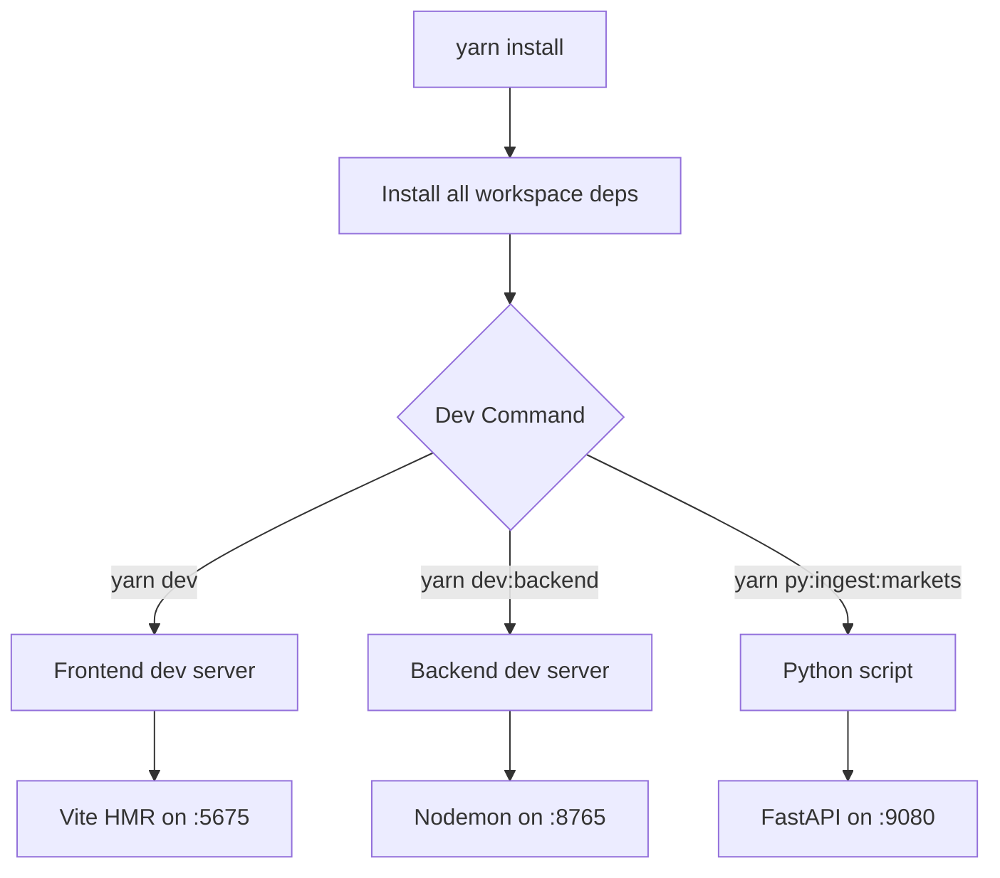
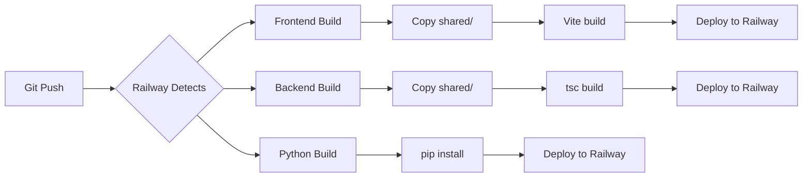

# Build Architecture

**Last Updated:** 2025-11-24  
**Location:** `docs/architecture/build-architecture.md` Documentation

**Repository**: Poloniex Trading Platform  
**Build System**: Yarn Workspaces + Railpack  
**Last Updated**: 2025

---

## Overview

This repository uses a **hybrid monorepo strategy** optimized for Railway deployment:
- **JavaScript/TypeScript**: Yarn Berry workspaces with native tooling
- **Python**: Independent pip/uv-based environments
- **Deployment**: Railpack for Railway service isolation
- **Coordination**: Root-level scripts for cross-workspace tasks

### Design Principles
1. ✅ **Service Isolation**: Each service builds independently in Railway
2. ✅ **Shared Code**: TypeScript shared modules bundled at build time
3. ✅ **Simple Tools**: Use platform-native tools (tsc, Vite, pip)
4. ✅ **Railway Optimized**: Railpack configs per service
5. ✅ **Developer Friendly**: Standard npm/yarn scripts

---

## Repository Structure

```
polytrade/
├── frontend/              # React 19 + Vite 7 SPA
│   ├── src/
│   ├── package.json
│   ├── railpack.json      # Railway build config
│   ├── prebuild.mjs       # Shared code bundler
│   └── vite.config.ts
│
├── backend/               # Express/Node API
│   ├── src/
│   ├── package.json
│   ├── railpack.json      # Railway build config
│   ├── prebuild.mjs       # Shared code bundler
│   └── tsconfig.build.json
│
├── python-services/
│   └── poloniex/          # FastAPI ML worker
│       ├── main.py
│       ├── pyproject.toml
│       ├── railpack.json  # Railway build config
│       └── requirements.txt
│
├── shared/                # Shared TypeScript code
│   ├── types/
│   ├── middleware/
│   └── logger.ts
│
├── scripts/               # Build automation
│   ├── bundle-shared.mjs  # Shared code bundler
│   ├── affected.mjs       # Affected workspace detection
│   ├── build-metrics.mjs  # Build performance tracking
│   └── workspace-health.js
│
├── package.json           # Root workspace config
├── railpack.json          # Root coordination file
└── yarn.lock              # Unified dependency lock
```

---

## Build Flow

### Local Development



#### Commands
```bash
# Install dependencies
yarn install

# Development servers
yarn dev              # Frontend only
yarn dev:backend      # Backend only
yarn dev:frontend     # Same as yarn dev

# Build for production
yarn build            # Build all services
yarn build:backend    # Backend only
yarn build:frontend   # Frontend only

# Testing
yarn test             # Run all tests
yarn test:run         # Run tests once (no watch)

# Quality checks
yarn lint             # Lint all workspaces
yarn lint:fix         # Auto-fix linting issues
yarn workspace:health # Check workspace integrity
yarn deps:health      # Check dependency health
```

---

### Railway Production Build



#### Railway Build Steps (per service)

**Frontend** (`frontend/railpack.json`):
1. Install: `yarn install --immutable`
2. Copy Shared: Prebuild script copies shared code
3. Build: `yarn build` (Vite)
4. Deploy: Static files served

**Backend** (`backend/railpack.json`):
1. Install: `yarn install --immutable`
2. Copy Shared: Prebuild script copies shared code
3. Build: `yarn build` (TypeScript)
4. Deploy: `node dist/src/index.js`

**Python ML Worker** (`python-services/poloniex/railpack.json`):
1. Install: `pip install -r requirements.txt`
2. Deploy: `uvicorn main:app`

---

## Shared Code Strategy

### Problem
Yarn workspaces expect a monorepo context, but Railway builds each service in isolation.

### Solution: Prebuild Bundling

Each TypeScript service has a `prebuild.mjs` script that copies `shared/` into its workspace:

```javascript
// frontend/prebuild.mjs or backend/prebuild.mjs
import { copyFileSync, mkdirSync, existsSync } from 'fs';
import { join, dirname } from 'path';

const sharedSrc = '../shared';
const sharedDest = './src/shared'; // or './shared' for backend

// Copy shared files recursively
function copyShared() {
  // Implementation copies .ts files from shared/
}

copyShared();
```

**Trigger**: Runs automatically via `prebuild` script in `package.json`:
```json
{
  "scripts": {
    "prebuild": "node prebuild.mjs",
    "build": "yarn run prebuild && vite build"
  }
}
```

### Path Aliasing

**TypeScript**: Uses path aliases to reference shared code:
```json
// tsconfig.json
{
  "compilerOptions": {
    "paths": {
      "@shared/*": ["shared/*"]
    }
  }
}
```

**Imports**:
```typescript
import { Logger } from '@shared/logger';
import type { Strategy } from '@shared/types/strategy';
```

---

## Dependency Management

### Yarn Berry Configuration

**Package Manager**: Yarn 4.9.2 (Berry)
```json
// package.json
{
  "packageManager": "yarn@4.9.2"
}
```

**Configuration** (`.yarnrc.yml`):
```yaml
enableGlobalCache: true
enableImmutableInstalls: true
nodeLinker: node-modules  # Use node_modules (not PnP)
```

### Workspace Dependencies

```json
// root package.json
{
  "workspaces": [
    "frontend",
    "backend"
  ]
}
```

**Rules**:
- ✅ All JavaScript dependencies in root `yarn.lock`
- ✅ Workspace-specific deps in workspace `package.json`
- ✅ Shared deps hoisted to root
- ❌ No duplicate `yarn.lock` files in workspaces
- ❌ No duplicate `node_modules` in workspaces

### Python Dependencies

**Package Management**: pip + pyproject.toml (uv-compatible)

```toml
# python-services/poloniex/pyproject.toml
[project]
name = "ml-worker"
requires-python = ">=3.11"
dependencies = [
    "fastapi>=0.111.0",
    "numpy>=1.26.0",
    # ...
]

[tool.uv]
dev-dependencies = [
    "pytest>=8.0.0",
    "ruff>=0.4.0"
]
```

**Why not include Python in Yarn workspaces?**
- Python and npm have incompatible dependency models
- Railway expects standard Python build patterns
- uv provides fast Python dependency resolution independently

---

## Railpack Configuration

### Root Coordination (`railpack.json`)

```json
{
  "$schema": "https://schema.railpack.com",
  "version": "1",
  "metadata": {
    "name": "polytrade-monorepo",
    "description": "Root coordination file"
  },
  "services": {
    "backend": {
      "root": "./backend",
      "build": { "provider": "node" }
    },
    "frontend": {
      "root": "./frontend",
      "build": { "provider": "node" }
    },
    "ml-worker": {
      "root": "./python-services/poloniex",
      "build": { "provider": "python" }
    }
  }
}
```

### Service-Specific Configs

**Frontend** (`frontend/railpack.json`):
```json
{
  "$schema": "https://schema.railpack.com",
  "version": "1",
  "build": {
    "provider": "node",
    "steps": [
      {
        "name": "install",
        "command": "cd .. && yarn install --immutable"
      },
      {
        "name": "build",
        "command": "yarn build",
        "dependsOn": ["install"]
      }
    ]
  },
  "deploy": {
    "startCommand": "yarn start"
  }
}
```

**Backend** (`backend/railpack.json`): Similar structure

**Python** (`python-services/poloniex/railpack.json`):
```json
{
  "$schema": "https://schema.railpack.com",
  "version": "1",
  "build": {
    "provider": "python",
    "pythonVersion": "3.11"
  },
  "deploy": {
    "startCommand": "uvicorn main:app --host 0.0.0.0 --port $PORT"
  }
}
```

---

## CI/CD Pipeline

### GitHub Actions

**Workflow**: `.github/workflows/railway-monitor.yml`

```yaml
name: Railway Deployment Monitor
on:
  push:
    branches: [main]

jobs:
  validate:
    runs-on: ubuntu-latest
    steps:
      - uses: actions/checkout@v4
      - uses: actions/setup-node@v3
        with:
          node-version: '22'
      - run: corepack enable
      - run: yarn install --immutable
      - run: yarn railway:validate
```

### Optimization Opportunities

**Affected-Only CI** (not yet implemented):
```yaml
# Future enhancement
- name: Detect affected workspaces
  run: node scripts/affected.mjs
- name: Test only affected
  run: |
    for ws in $AFFECTED; do
      yarn workspace $ws test:run
    done
```

**Build Caching** (Railway provides):
- Yarn cache: Automatic via Railway
- Docker layers: Automatic via Railway
- Remote build cache: Railpack handles

---

## Adding New Services

### Checklist for New Service

#### TypeScript Service (e.g., New API)

1. **Create Workspace**
   ```bash
   mkdir new-service
   cd new-service
   yarn init
   ```

2. **Add to Root Workspaces**
   ```json
   // package.json
   {
     "workspaces": [
       "frontend",
       "backend",
       "new-service"  // Add here
     ]
   }
   ```

3. **Create Railpack Config**
   ```json
   // new-service/railpack.json
   {
     "$schema": "https://schema.railpack.com",
     "version": "1",
     "build": {
       "provider": "node",
       "steps": [
         {
           "name": "install",
           "command": "cd .. && yarn install --immutable"
         },
         {
           "name": "build",
           "command": "yarn build",
           "dependsOn": ["install"]
         }
       ]
     }
   }
   ```

4. **Add to Root Railpack**
   ```json
   // railpack.json
   {
     "services": {
       "new-service": {
         "root": "./new-service",
         "build": { "provider": "node" }
       }
     }
   }
   ```

5. **Configure Railway Service**
   - Railway Dashboard → New Service
   - Link to GitHub repo
   - Set Root Directory: `new-service`
   - Deploy

#### Python Service

Similar steps, but:
- Use `pyproject.toml` instead of `package.json`
- Set `"provider": "python"` in Railpack
- Configure Python version in Railpack
- Railway will use pip/uv automatically

---

## Build Performance

### Current Metrics (Approximate)

| Service | Local Build | Railway Build | Deploy Time |
|---------|-------------|---------------|-------------|
| Frontend | ~60s | ~90s | ~120s total |
| Backend | ~30s | ~45s | ~75s total |
| Python | ~20s | ~30s | ~60s total |

### Monitoring

**Enable Build Metrics**:
```bash
# Track build times
node scripts/build-metrics.mjs frontend
node scripts/build-metrics.mjs backend

# Analyze trends
node scripts/build-metrics.mjs analyze
```

**Metrics Collected**:
- Build duration (per workspace)
- Memory usage
- Success/failure rate
- Historical trends

**Alerts**:
- Build >5 minutes: Investigate
- Build >10 minutes: Critical, requires optimization

### Optimization Strategies

**If Builds Become Slow** (>5 min):

1. **Check for unnecessary file copying**
   ```bash
   # Verify .railwayignore excludes:
   node_modules/
   dist/
   coverage/
   .git/
   ```

2. **Analyze bundle size**
   ```bash
   # Frontend
   yarn workspace frontend build
   ls -lh frontend/dist

   # Look for large chunks
   ```

3. **Enable Railway build caching**
   - Already enabled by default
   - Verify in Railway logs: "Using cached layer"

4. **Consider incremental builds**
   - TypeScript: Already enabled (`--incremental`)
   - Vite: Already optimized

5. **Profile slow dependencies**
   ```bash
   yarn deps:health
   ```

6. **Consider Nx if services grow to 5+**
   - See `docs/MONOREPO_TOOLING_ANALYSIS.md`

---

## Troubleshooting

### Common Issues

#### 1. "Cannot find module '@shared/...'"

**Cause**: Shared code not bundled before build

**Solution**:
```bash
# Run prebuild manually
cd frontend  # or backend
node prebuild.mjs

# Verify shared code copied
ls -la src/shared/
```

#### 2. "Workspace not found" in Railway

**Cause**: Railway root directory not set correctly

**Solution**:
- Railway Dashboard → Service Settings
- Set Root Directory to `frontend` or `backend`
- Redeploy

#### 3. "yarn.lock out of sync"

**Cause**: Dependencies changed without updating lock file

**Solution**:
```bash
# From root
yarn install
git add yarn.lock
git commit -m "chore: update yarn.lock"
```

#### 4. Python dependencies conflict

**Cause**: pip dependency resolution issues

**Solution**: Use uv for faster resolution
```bash
cd python-services/poloniex
pip install uv
uv sync
```

#### 5. Build succeeds locally but fails in Railway

**Causes**:
- Environment variable missing
- Railway root directory incorrect
- Path aliases not resolving

**Debug**:
```bash
# Check Railway logs for specific error
# Verify environment variables in Railway dashboard
# Ensure railpack.json is valid
yarn railway:validate
```

---

## Best Practices

### Development

✅ **Do**:
- Run `yarn install` from root (not in workspaces)
- Use workspace commands: `yarn workspace frontend dev`
- Keep shared code minimal and well-typed
- Test locally before pushing to Railway
- Use `.env.example` to document required env vars

❌ **Don't**:
- Run `yarn install` inside workspace directories
- Create duplicate `yarn.lock` files in workspaces
- Import from `../shared` directly (use `@shared/`)
- Commit `node_modules` or `dist/` directories
- Mix npm and yarn commands

### Deployment

✅ **Do**:
- Use Railpack configs for Railway
- Set Railway root directory per service
- Keep Railpack steps minimal
- Use Railway environment variables
- Monitor deployment logs

❌ **Don't**:
- Override Railway build commands manually
- Hard-code service URLs
- Deploy untested code
- Skip validation checks

### Performance

✅ **Do**:
- Monitor build times quarterly
- Use `.railwayignore` to exclude test files
- Enable TypeScript incremental builds
- Lazy load heavy dependencies (TensorFlow.js)

❌ **Don't**:
- Import entire libraries (`import * from 'lodash'`)
- Bundle tests in production builds
- Skip tree-shaking optimization

---

## Migration Guides

### If Adopting Nx (Future)

See `docs/MONOREPO_TOOLING_ANALYSIS.md` → "If Migrating to Nx"

**Summary**:
- Add Nx to existing workspaces: `npx nx@latest init`
- Migrate scripts gradually (4-6 weeks)
- Update Railway configs to use Nx commands
- Train team on Nx patterns

**Triggers for Nx**:
- Service count >5
- Team size >5 developers
- Build time consistently >5 minutes
- Need task orchestration

### If Adopting uv for Python

**Benefits**:
- 10-100x faster than pip
- Better dependency resolution
- Workspace support

**Migration**:
```bash
# Install uv
curl -LsSf https://astral.sh/uv/install.sh | sh

# Convert requirements.txt to pyproject.toml (already done)
cd python-services/poloniex

# Sync dependencies
uv sync

# Update Railway config
# python-services/poloniex/railpack.json
{
  "build": {
    "steps": [
      {
        "name": "install",
        "command": "pip install uv && uv sync"
      }
    ]
  }
}
```

---

## Resources

### Documentation
- [Yarn Workspaces](https://yarnpkg.com/features/workspaces)
- [Railpack Reference](https://docs.railway.com/reference/railpack)
- [Railway Monorepos](https://docs.railway.com/tutorials/deploying-a-monorepo)
- [TypeScript Project References](https://www.typescriptlang.org/docs/handbook/project-references.html)

### Repository Docs
- `docs/MONOREPO_TOOLING_ANALYSIS.md` - Tool selection guide
- `CLAUDE.md` - Railway best practices
- `docs/deployment/RAILWAY_BACKEND_FIX.md` - Build isolation patterns

### Scripts
- `scripts/affected.mjs` - Affected workspace detection
- `scripts/build-metrics.mjs` - Build performance tracking
- `scripts/workspace-health.js` - Workspace integrity checks
- `scripts/bundle-shared.mjs` - Shared code bundler

---

**Document Version**: 1.0  
**Maintained By**: Development Team  
**Review Cycle**: After major architecture changes
